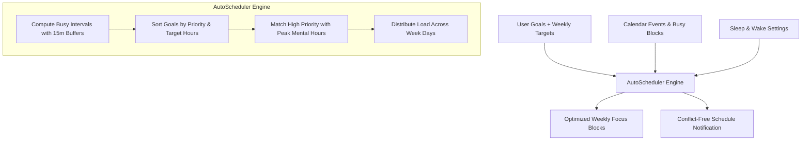

<div align="center">

# ⏱️ FocusFlow

### *Intelligent Routine Planning & Deep-Work Flow Assistant*

[](https://expo.dev)
[](https://reactnative.dev)
[](https://react.dev)
[](https://www.typescriptlang.org/)
[](https://github.com/pmndrs/zustand)
[](https://opensource.org/licenses/MIT)

<br/>

**FocusFlow** is an intelligent, cross-platform productivity and deep-work companion built with React Native and Expo. It automates your schedule planning by intelligently weaving goal-oriented focus sessions around your existing calendar events and sleep/wake routines. Featuring customizable Pomodoro timers, a persistent floating mini-player, device calendar synchronization, background alarms, and comprehensive progress analytics.

[Features](#-key-features) • [Tech Stack](#-tech-stack) • [Getting Started](#-getting-started) • [Architecture](#-project-structure) • [Auto-Scheduler](#-the-auto-scheduler-algorithm) • [Contributing](#-contributing)

</div>

---

## 🌟 Key Features

### 🧠 1. Intelligent Auto-Scheduler
- **Smart Time-Slot Allocation:** Automatically analyzes your weekly commitments, sleep/wake hours, and user-defined busy slots to generate optimal deep-work sessions.
- **Priority-Weighted Placement:** Allocates high-priority goals into peak cognitive energy hours (morning/prime working hours).
- **Buffer Zones & Sleep Awareness:** Enforces 15-minute buffers between blocks and respects overnight/shift-work sleep windows.
- **Balanced Load Distribution:** Distributes focus sessions evenly across the 7 days of the week to prevent burnout.

### 🍅 2. Deep-Work & Pomodoro Engine
- **Customizable Interval Cycles:** Configure work sessions (e.g., 25m), short breaks (5m), long breaks (15m), and cycle frequencies.
- **Circular Progress Timer:** Immersive visual countdown with smooth animations, pause/resume, session extension, and skip-phase controls.
- **Persistent Floating Mini-Player:** Keep track of ongoing sessions with an animated mini-player that remains accessible across all tabs while you browse schedules or stats.
- **Sensory Feedback:** Integrated with `expo-haptics` for tactile ticks and `expo-audio` for end-of-session chimes.
- **Screen Keep-Awake:** Keeps the display active during deep-work mode via `expo-keep-awake`.

### 📅 3. Device Calendar Integration
- **Two-Way Sync:** Connects directly with device calendars (Apple Calendar, Google Calendar, Outlook) and iOS Reminders using `expo-calendar`.
- **Automatic Conflict Avoidance:** External events are seamlessly pulled into the schedule grid as read-only busy blocks to prevent overlapping sessions.
- **Interactive Weekly Grid:** Weekly timeline view with draggable-style time blocking and quick-add block modals.

### 📊 4. Habit Tracking & Visual Analytics
- **Visual Trend Line Charts:** Interactive weekly focus hour tracking powered by `react-native-chart-kit`.
- **Goal Distribution Breakdown:** Color-coded pie chart illustrating time investment across categories (Work, Study, Fitness, Creative, etc.).
- **Contribution Heatmaps:** GitHub-style daily activity visualization.
- **Streak Tracker:** Tracks consecutive active days, current streaks, longest streaks, and lifetime focus minutes.

### 🎨 5. Modern UX & Native Performance
- **React Native New Architecture:** Fully enabled (`newArchEnabled: true`) with React Native Reanimated v4 for fluid 60fps animations.
- **Offline-First Persistence:** Instant local persistence using Zustand with AsyncStorage.
- **Dark & Light Mode:** Tailored color palettes with automatic system theme adaptation.
- **Privacy & Export:** Full local data ownership — export complete user data as JSON or reset at any time.

---

## 📱 App Walkthrough

| 🏠 Dashboard & Next Up | 📅 Smart Schedule Grid | ⏱️ Active Focus Timer | 📊 Progress & Streaks |
|:---:|:---:|:---:|:---:|
| Quick overview of today's focus hours, upcoming sessions, and current streak | Weekly time grid showing calendar events and auto-scheduled focus blocks | Circular countdown timer with Pomodoro phase controls and haptics | Weekly trend charts, goal distribution pie charts, and streak milestones |

---

## 🛠️ Tech Stack

| Layer | Technology | Description |
| :--- | :--- | :--- |
| **Core Framework** | [React Native 0.81.5](https://reactnative.dev/) | Cross-platform native mobile foundation |
| **Runtime & Tooling** | [Expo SDK 54](https://expo.dev/) | Modern mobile platform with New Architecture enabled |
| **Routing** | [Expo Router v6](https://docs.expo.dev/router/introduction/) | Type-safe, file-based routing with tab navigation |
| **Language** | [TypeScript 5.9](https://www.typescriptlang.org/) | Strict type checking and developer experience |
| **State Management** | [Zustand 5.0](https://github.com/pmndrs/zustand) | Lightweight, hook-based state with AsyncStorage persistence |
| **Animations** | [React Native Reanimated 4](https://docs.swmansion.com/react-native-reanimated/) | Declarative UI thread animations |
| **Charts** | [react-native-chart-kit](https://github.com/indiespirit/react-native-chart-kit) & [react-native-svg](https://github.com/software-mansion/react-native-svg) | Line charts, pie charts, and contribution graphs |
| **Device APIs** | `expo-calendar`, `expo-notifications`, `expo-haptics`, `expo-audio`, `expo-keep-awake` | Native hardware access and device calendar integration |
| **Build & Deployment**| [EAS Build](https://expo.dev/eas) | Cloud and local native build pipeline |

---

## 🚀 Getting Started

### Prerequisites
Make sure you have the following installed on your machine:
- **Node.js**: `v18.x` or higher
- **npm**, **yarn**, or **pnpm**
- **Expo Go** app on your physical iOS/Android device OR an iOS Simulator / Android Studio Emulator

### Installation

1. **Clone the repository:**
   ```bash
   git clone https://github.com/ejezie/focus-flow.git
   cd focus-flow
   ```

2. **Install dependencies:**
   ```bash
   npm install
   ```

3. **Start the development server:**
   ```bash
   npx expo start
   ```

4. **Run on a device or emulator:**
   - Press <kbd>i</kbd> to launch in the **iOS Simulator**.
   - Press <kbd>a</kbd> to launch in the **Android Emulator**.
   - Scan the QR code in your terminal with the **Expo Go** app (Android) or the **Camera app** (iOS).

---

## 📂 Project Structure

```text
focus-flow/
├── app/                          # Expo Router file-based route definitions
│   ├── (tabs)/                   # Bottom tab navigator screens
│   │   ├── index.tsx             # Home: Today's summary, quick stats, next session
│   │   ├── schedule.tsx          # Schedule: Interactive weekly grid & auto-scheduler trigger
│   │   ├── focus.tsx             # Focus: Pomodoro session launcher & timeline
│   │   ├── progress.tsx          # Progress: Analytics, line charts, pie charts & streaks
│   │   └── goals.tsx             # Goals: Goal creation, priority ranking, and weekly targets
│   ├── focus/
│   │   └── active.tsx            # Fullscreen active Pomodoro timer screen
│   ├── onboarding.tsx            # Multi-step onboarding setup wizard
│   ├── settings.tsx              # Settings: Calendar permissions, durations, data export
│   └── _layout.tsx               # Root layout: Theme providers, splash screen, MiniPlayer
├── components/                   # Reusable UI component library
│   ├── focus/                    # CircularTimer, MiniPlayer, FocusWeekView, PomodoroCards
│   ├── schedule/                 # WeekView calendar grid, AddBlockModal
│   ├── goals/                    # AddGoalModal, GoalItem
│   ├── settings/                 # CalendarSettings, interval pickers
│   └── ui/                       # IconSymbol, QuickTipsOverlay, Collapsible
├── store/                        # Zustand stores (offline-first persistence)
│   ├── focusStore.ts             # Active timer session, phases (work/break), pause state
│   ├── goalStore.ts              # Goals state (CRUD, categories, priorities, target hours)
│   ├── scheduleStore.ts          # Schedule blocks, calendar sync, permissions
│   ├── settingsStore.ts          # User preferences (sleep/wake, Pomodoro timings, theme)
│   ├── statsStore.ts             # Streak calculations, daily histories, per-goal analytics
│   └── syncNotifications.ts      # Automatic notification sync listener
├── utils/                        # Core algorithms and helper services
│   ├── scheduler/                # AutoScheduler algorithm (interval merging & slot placement)
│   ├── notifications/            # Notification service, background alarms, audio cues
│   └── time/                     # Time fractions, hour formatting, date conversion
├── constants/                    # Design tokens, color presets, TypeScript definitions
│   ├── theme.ts                  # Light/Dark theme color palettes
│   └── types/                    # Domain types (ScheduleBlock, Goal, DayIndex)
├── assets/                       # Static assets (app icons, sounds, splash screens)
├── app.json                      # Expo application manifest & native permissions
└── package.json                  # Dependencies, scripts, and project metadata
```

---

## 🧩 The Auto-Scheduler Algorithm

FocusFlow's auto-scheduling engine (`utils/scheduler/AutoScheduler.ts`) turns chaotic weeks into structured focus routines:



1. **Interval Merging:** Combines sleep schedules, user-defined busy blocks, and external calendar events into continuous blocked intervals, adding 15-minute buffer windows.
2. **Priority-Based Sorting:** Ranks goals by priority level (1–5) and required weekly hours.
3. **Smart Slot Allocation:** Evaluates available open slots across the week, preferring morning and peak work windows (08:00–18:00) for highest-priority goals.
4. **Session Chunking:** Chunks targets into optimal focus sessions (between 30 and 90 minutes) to maximize attention span and flow state.

---

## ⚙️ Configuration & Customization

You can adjust all default parameters directly from within the app settings or via the store defaults:

| Setting | Default | Description |
| :--- | :---: | :--- |
| `wakeTime` | `07:00` | Start of daily active window |
| `sleepTime` | `23:00` | End of daily active window (supports shift work) |
| `pomodoroWorkDuration` | `25 mins` | Length of a single deep-work session |
| `pomodoroBreakDuration` | `5 mins` | Length of a short break |
| `pomodoroLongBreakDuration` | `15 mins` | Length of a long recovery break |
| `sessionsBeforeLongBreak` | `4` | Number of work sessions before triggering a long break |
| `reminderMinutes` | `15 mins` | Pre-session push notification alert |
| `autoStartBreaks` | `false` | Automatically advance into break intervals |

---

## 📦 Native Builds (Android / iOS)

The repository comes pre-configured with **EAS Build** (`eas.json`):

### Android APK Preview
```bash
npm run build-android-preview
# OR using EAS:
npx eas build --profile preview --platform android
```

### Production Build
```bash
npx eas build --profile production --platform all
```

---

## 🔒 Permissions

FocusFlow requests permissions only for features that directly benefit the user experience:
- **Calendars & Reminders (`expo-calendar`):** Used to detect existing events and prevent scheduling conflicts.
- **Notifications (`expo-notifications`):** Used for session start alerts and Pomodoro timer completion alarms.
- **Audio & Haptics (`expo-audio`, `expo-haptics`):** Used to signal phase transitions when the device is locked or the app is in the background.

---

## 🤝 Contributing

Contributions, issues, and feature requests are welcome!

1. Fork the repository
2. Create your feature branch (`git checkout -b feature/amazing-feature`)
3. Commit your changes (`git commit -m 'feat: add some amazing feature'`)
4. Push to the branch (`git push origin feature/amazing-feature`)
5. Open a Pull Request

---

## 📄 License

This project is open-source and available under the [MIT License](LICENSE).

---

<div align="center">
  Crafted with ❤️ for thinkers, builders, and deep workers.
</div>
